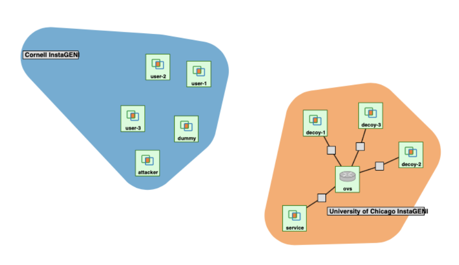

This implementation can not be run without setting up multiple topolgoies to run the scripts. You would need to move certain scripts to certain instances.  
  
   

Files I worked on are the following, and most I created/redid are:
ALL Flask implementations and hosting,
1) About.html
2) attacker_UI.py
3) attackerUi.html
4) ddos_singular.py
5) ddos_super.py
6) migrate script
7) decoy.txt
8) decoy_clients.py
9) index.html
10) receiver.py
11) sender.py
12) server.py
13) sysadmin.html
14) sysadmin_UI.py
15) ids.py
16) main_page.html
17) decoy_receiver1-3.py (He took my code and changed it a little)
18) decoy_server.py (He refused to use it)
19) decoy_save1-3.py
20) main_pageV2.html

Editations of:
mig_server.py
decision_engine.py
ids_client
mig_client
and maybe 2-3 others.

http://192.122.236.119:5000/attacker_UI -- ATTACKER UI
http://192.122.236.119:5000/results -- ATTACK RESULTS
http://192.170.230.112:5000/adminUI  -----OVS ADMIN
http://192.170.230.113:5000/home -- original location

That is NOT all the files needed; however, that is most

As for starting the service, you do the following
1) OVS script (waitress-serve --port=5000 sysadmin_UI:app) and (python3 mig_server.py)
2) Decoys (waitress-serve --port=5000 decoy_save:app) and (python3 decoy1-3_server.py)
3) Service ( waitress-serve --port=5000 ids:app)
4) Attacker (waitress-serve --port=5000 attacker_UI:app)
5) Increase intensity once (you can do multiple but the connection limit makes it pointless)
6) Data is "migrated" (Apparently someone originally migrated it to the OVS and then left it there, I think the plan was supposed to be Server -> OVS -> Decoy Comp); however, the files are there, and ready
7) Simply click the redirect button to get to the page
